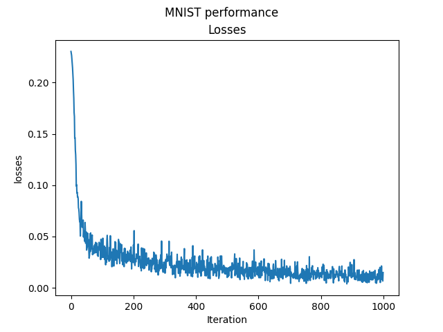

## What
This a machine learning library that achieves Model accuracy of about 95% on the MNIST dataset, its built on top of numpy

<p align="center">
	 
</p>

Heavily inspired by https://github.com/karpathy/micrograd and https://github.com/geohot/tinygrad 

## Why
This is an educational project. I wish to learn how machine learning libraries work under the hood
## Usage
You can train the model by executing the following command:
```bash
python mnist.py
```

## ToDo
- [ ] Add support for GPUs (Triton??)
- [ ] Build some model on top of this
  - [.] DQN on cartpole
  - [ ] VAE on on MNIST
- [ ] Move away from numpy
- [ ] Add tests
